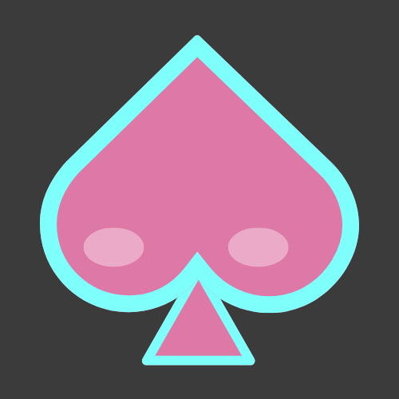

<p align="center">
  
</p>

<h1 align="center">🌙 NightLeaf</h1>

<p align="center">
  A personal manga discovery platform built with Flask, SQLite, and a neon-inspired UI.
</p>

<p align="center">
  🚀 <b>Live Website:</b> <i>[Add deployed link here]</i>
</p>

---

## 📖 About the Project

**NightLeaf** is a passion project created to explore manga discovery, search, and collection management in a clean, modern web interface.

The platform allows users to:
- Browse manga
- Search with advanced filters
- View detailed manga information
- Like mangas and build a personal collection

This project focuses on **clean UI/UX**, **scalable backend design**, and **real-world product features** rather than just static pages.

---

## ✨ Features

- 🔍 **Advanced Search**
  - Search by name
  - Filter by status, genres, and release year
  - Sort results (A–Z, Z–A, Oldest, Latest)

- 📚 **Explore Page**
  - Browse manga in a grid layout
  - Visual “Liked” badges on cards

- 📂 **Manga Directory**
  - Alphabetical A–Z list of all manga

- ❤️ **Like & Collection System**
  - Like / Unlike mangas
  - Persistent personal collection
  - Visual liked indicators across the site

- 📄 **Manga Detail Page**
  - Detailed information
  - Clean layout with preserved image ratios
  - One-click back navigation

- 🌙 **Custom UI**
  - Dark theme
  - Neon blue & pink accents
  - Consistent navigation across pages

---

## 🛠 Tech Stack

- **Backend:** Flask (Python)
- **Database:** SQLite
- **Frontend:** HTML, CSS, Jinja2
- **Styling:** Custom CSS (Neon/Dark theme)
- **Data Source:** Imported via public manga APIs (AniList)

---

## 📁 Project Structure

```text
.
├── app.py
├── database.db
├── templates/
│   ├── landing.html
│   ├── index.html
│   ├── search.html
│   ├── directory.html
│   ├── manga.html
│   ├── collection.html
│   └── 404.html
├── static/
│   ├── css/
│   │   └── base.css
│   └── images/
│       └── nightleaf-logo.png
└── README.md
'''